# Credentia

A trusted professional network for healthcare professionals, dental-first with a
data model designed to expand to any licensed profession. Verified credentials,
role-based visibility, and a familiar feed/discover/messages/notifications/profile
shell built with Flutter and Riverpod.

## Demo

| iOS | Android |
|---|---|
| 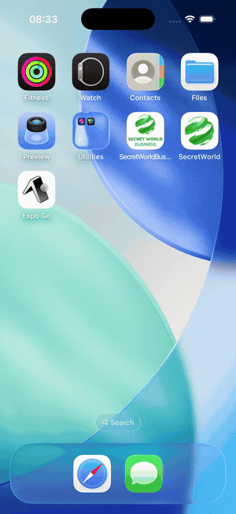 | 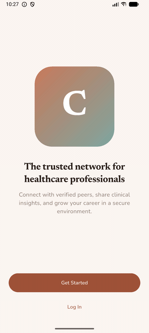 |

Same codebase running on both platforms.

## Screenshots

| Onboarding | Sign up | Feed |
|---|---|---|
| 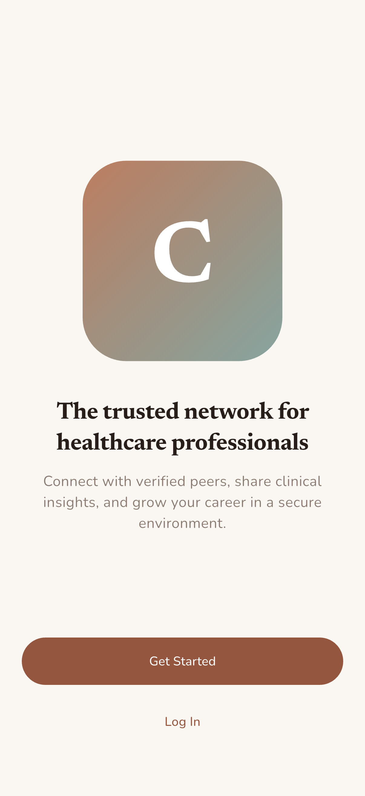 | 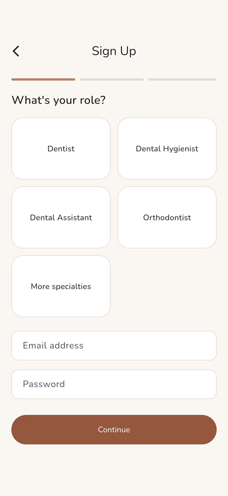 | 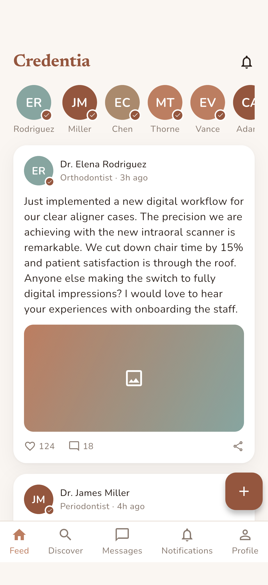 |

| Discover | Professional profile | Messages |
|---|---|---|
| 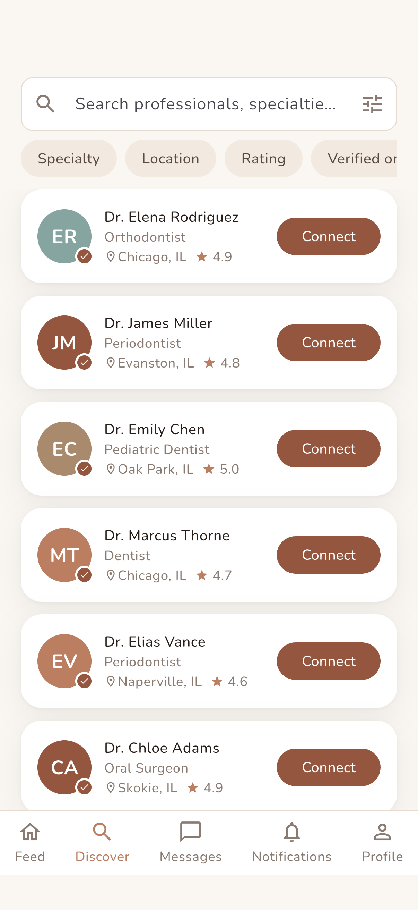 | 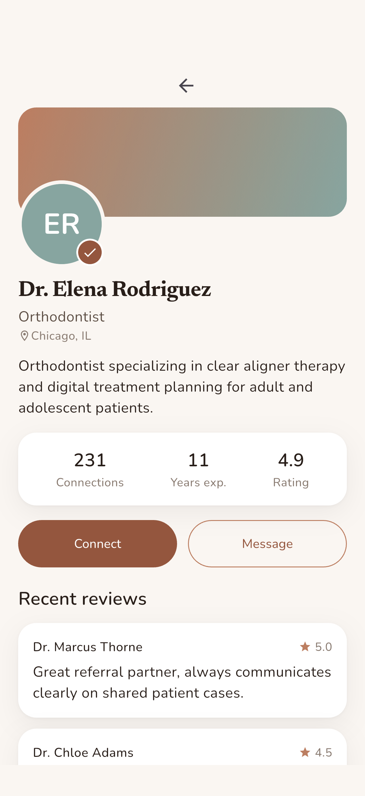 | 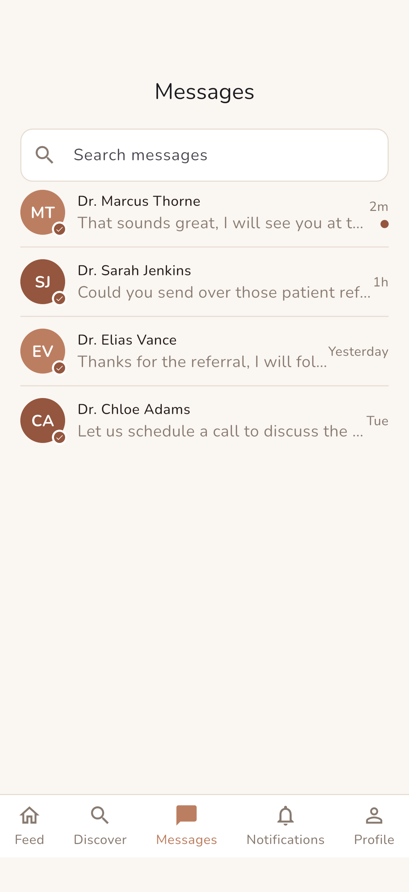 |

| Chat | Notifications | My profile |
|---|---|---|
| 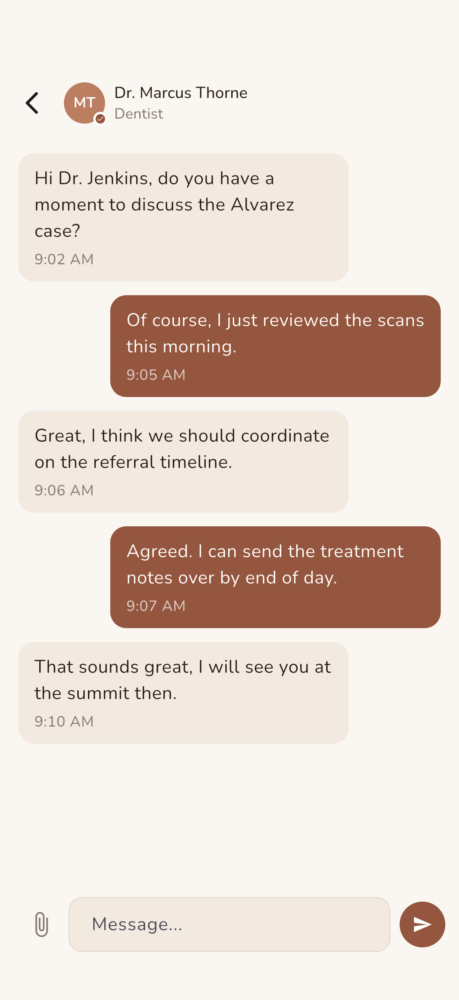 | 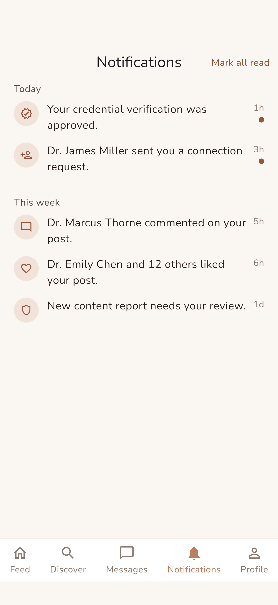 | 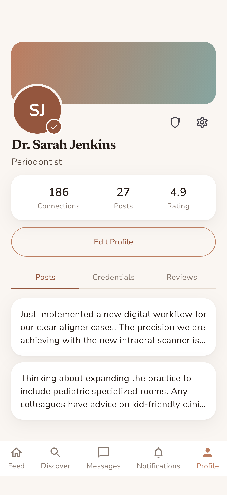 |

## What it shows

- Credential-gated onboarding: role selection, license/NPI verification step, and
  an admin queue to approve or reject pending verifications.
- A professional feed with public/connections-only/private post visibility,
  comments, and reactions.
- Discover and connect with other verified professionals by specialty, location,
  and rating - including empty states for zero-result searches.
- Direct messaging between connected professionals, with an empty state for a
  fresh inbox.
- Notifications grouped by recency, with per-field profile visibility controls
  (phone, license number) and a dedicated privacy settings screen.
- Content reporting flow for moderation.

## Architecture

- **Flutter + Riverpod** for state management (`StateProvider`s for feed posts,
  search query, conversations, notifications, bottom nav index).
- Screens are grouped by feature under `lib/screens/` (onboarding, feed, discover,
  messages, notifications, profile, admin), sharing a common `MainShell` bottom
  tab shell (Feed, Discover, Messages, Notifications, Profile).
- `lib/theme/app_theme.dart` centralizes the design system: colors, type scale,
  radii, and shadows pulled directly from the Stitch design tokens in `design/`.
- `lib/models/` holds plain Dart models and realistic mock data - no backend, this
  is a UI/UX proof of concept.
- Fonts (Nunito, Newsreader) are bundled locally under `assets/fonts/` rather than
  fetched at runtime, so the app works fully offline.

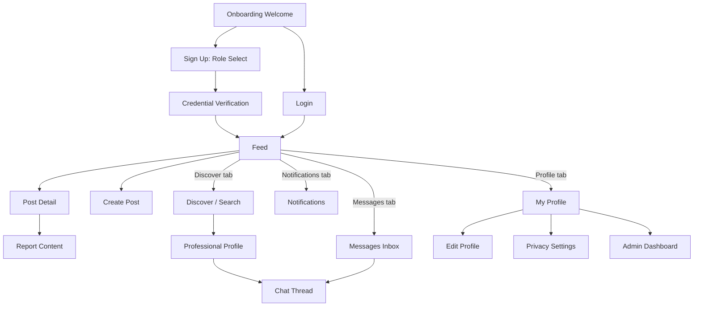

## Run

```sh
flutter pub get
flutter run
```

Requires Flutter 3.x with Dart 3.12+. No backend or API keys needed, everything
runs on local mock data.
